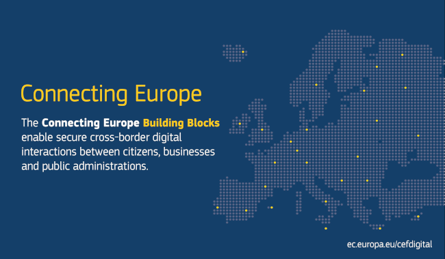

..
   Note: Items in this toctree form the top-level navigation. See `api.rst` for the `autosummary` directive, and for why `api.rst` isn't called directly.

.. toctree::
   :hidden:

   Home <self>
   Tutorials <tutorials>
   API Reference <_autosummary/st_lucas>

ST_LUCAS Python API
===================

           
ST_LUCAS Python package (C1) provides communication between the web
server (A2) and the users’ clients through API. The package
implemented in the Python 3 programming language consists of three
modules: (1) ``request``: to create a request by specifying spatial,
temporal, attribute or thematic filters; (2) ``io``: to retrieve
harmonized LUCAS data provided by the web service (A2) based on the
submitted request, and to store the retrieved data to the user local
file system (C2) in a specified data format; (3) ``analyze``: to
analyze the received harmonized LUCAS data - LUCAS land cover classes
aggregation and nomenclature translation.

The client Python API can be used directly by the Python code (CLI),
running the `Jupyter Notebook <./tutorials.html>`__ or the `QGIS
developed plugin <../qgis_plugin/>`__ (GUI).

Installation
------------

Run the following from the root directory of the repository:

.. code-block:: shell-session

   python3 -m pip install .

Contributing
------------

The library has been developed and used by a group of active community
members. Your help is very valuable to make the package better for
everyone. Check also our `open issues
<https://gitlab.com/geoharmonizer_inea/st_lucas/st_lucas-python-package/-/issues?sort=updated_desc&state=opened>`__.

License
-------

`MIT <https://gitlab.com/geoharmonizer_inea/st_lucas/st_lucas-python-package/blob/main/LICENSE>`__

Funding
-------

This work is co-financed under Grant Agreement Connecting Europe
Facility (CEF) Telecom `project 2018-EU-IA-0095
<https://ec.europa.eu/inea/en/connecting-europe-facility/cef-telecom/2018-eu-ia-0095>`_
by the European Union.

